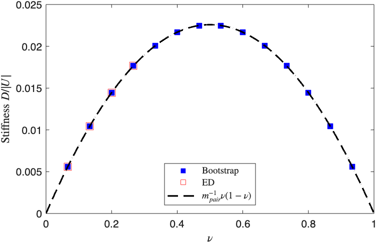
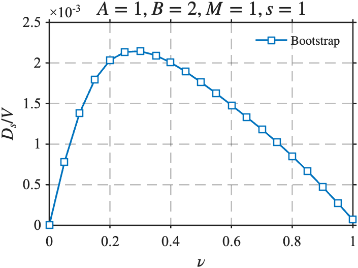

# BootstrapSC
This repository contains the <u>minimal example codes</u> for the project: ***bootstrapping the flatband superconductors***. This project belongs to a large ongoing project: ***(Fermionic) Quantum Many-body Bootstrap***, which is currently under development. 
In this small repository, you will be able to use the codes to reproduce part of the results presented in two recent preprints: bootstrapping spinful flatband superconductors [^gao2025] and bootstrapping spinless chiral flatband superconductors [^han2025]

## Introduction
Quantum many-body problems are notoriously hard because the number of degrees of freedom grows exponentially with system size. Solving such problems therefore, calls for techniques that can circumvent the resulting exponential complexity, motivating major advances in both theory and numerics, including Hartree–Fock (mean-field), quantum Monte Carlo, and the density-matrix renormalization group (DMRG). However, these methods have intrinsic limitations, often relying on weak correlations or low entanglement. This raises a natural question: How can we make *reliable* predictions in quantum many-body systems where brute-force simulation is impossible and uncontrolled approximations abound? This project seeks to address this by developing the *quantum many-body bootstrap* (QMB): a hierarchy of convex relaxations that enforce first principles—unitarity, causality/locality, gauge invariance, positivity, and sum rules—to yield *rigorous, systematically improvable bounds* on physical observables.

QMB reframes strongly interacting quantum systems as *convex optimization over observables* rather than a search over exponentially large wavefunctions. Instead of parameterizing $|\psi\rangle$, one works with low-order correlation data—e.g., the static structure factor $S(\mathbf{q})$ or $p$-particle reduced density matrices ($p$-RDMs). These objects must satisfy general physical principles that are independent of microscopic details: matrix-positivity of moment and RDM matrices; locality and short-distance constraints; and symmetries such as U(1), translation, and rotation. Upon choosing a proper physical quantity as the optimization variable, these constraints define a convex feasible set of such variables.

Minimizing the energy (or other figures of merit) over this feasible set yields rigorous *lower bounds* that improve monotonically as additional constraints are imposed. In the dual picture, the bootstrap produces *certificates* (extremal functionals) that witness optimality and pinpoint which constraints are saturated, giving mechanistic insight. Because all constraints are linear or convex, the problems are naturally expressed as semidefinite programs (SDPs) that leverage mature numerical infrastructure.

## Bootstrapping the superfluid stiffness in flatband superconductors
In the recent preprint [^gao2025], we showed that for flat-band superconductors, there could be *provable lower bounds* on the zero-temperature superfluid stiffness $D_s$ in frustration-free interacting models via the RDM bootstrap; the bounds scale with interaction strength and band quantum geometry and numerically match variational upper bounds, suggesting the exactness of the results obtained. Later, in a follow-up work [^han2025], we used QMB to certify nonzero $D_s$ extrapolated to the thermodynamic limit and identified two nearly degenerate, particle–hole conjugate pairing channels with distinct Majorana Chern numbers, which, combined with variational approaches, predict two tunable superconducting domes controlled by displacement field and carrier density and tying band geometry to stiffness and topology.

Now, we are going to disclose the two sets of minimal example codes for reproducing part of the essential results presented in those two works. The purpose of this repository is primarily to show how the QMB works, which however is not documented. A fully documented version will be released separately.

## Coding Instructions
### Prerequisites
- MATLAB R2022b or later (licensed)
- SDP solver: [MOSEK](https://www.mosek.com/)
- MATLAB interface: [YALMIP](https://yalmip.github.io/)
- Special-functions package: [SpecFunPhys Toolbox](https://wolfgang-schweizer.de/books/special-functions-in-physics-with-matlab/)

The Special-functions package is only needed when you want to reproduce the data points for the case of the spinless chiral superconductor.

### Installation
1) Install MATLAB R2022b+ on your machine.
2) Install MOSEK and ensure a valid license is available (free for academic use).
3) Install YALMIP and add it to the MATLAB path.
4) Install the SpecFunPhys Toolbox and add it to the MATLAB path.
5) Add this repository to the MATLAB path.

Detailed installation instructions can be found on the associated webpages. Or you can use any AI chatbox (ChatGPT, DeepSeek, et.) to help you with the installation.

Commands for adding the paths (inside MATLAB):
```matlab
addpath 'path/to/Mosek/toolbox';
addpath(genpath('path/to/this/repo'));
addpath(genpath('path/to/yalmip'));
addpath(genpath('path/to/specfunphys'));
```
Please replace the placeholders with the actual paths on your machine.

## Run the codes
There are two sets of codes provided corresponding to the spinful and spinless cases, respectively.

### A. Spinful case
In the example code (`main_example_code_spinful.m`), we demonstrate the usage of the bootstrap and ED calculations for the following system:
```matlab
% System size: Nx by Ny, where both Nx and Ny are odd numbers
Nx = 3;
Ny = 5;
% Particle number: N, an even number (from 2 to 2*Nx*Ny) to ensure the 
% superconducting ground state.
N = 6;
```
which is a $3\times 5$ $k$-grid (30 orbitals including spins) with 6 electrons occupied. The flatband model used here is the *Model I* defined in preprint [^gao2025], which is a topological flatband model. Notice that the provided codes work only for systems with odd by odd grids and even particle occupations.

Simply run the code (inside MATLAB)
```matlab
>> main_example_code_spinful
```
you will see the output:
```
The stiffness for Nx=3, Ny=5, and N=6 from bootstrap is 0.014456163198, with runtime 14.6910s
The stiffness for Nx=3, Ny=5, and N=6 from ED is 0.014456564315, with runtime 30.9391s
Bootstrapping stiffness for Nx=3, Ny=5, and N=2 	Runtime: 9.2486s
Bootstrapping stiffness for Nx=3, Ny=5, and N=4 	Runtime: 13.0479s
Bootstrapping stiffness for Nx=3, Ny=5, and N=6 	Runtime: 12.9743s
Bootstrapping stiffness for Nx=3, Ny=5, and N=8 	Runtime: 12.9818s
Bootstrapping stiffness for Nx=3, Ny=5, and N=10 	Runtime: 13.0428s
Bootstrapping stiffness for Nx=3, Ny=5, and N=12 	Runtime: 13.6438s
Bootstrapping stiffness for Nx=3, Ny=5, and N=14 	Runtime: 14.0747s
ED stiffness for Nx=3, Ny=5, and N=2 	Runtime: 0.0154s
ED stiffness for Nx=3, Ny=5, and N=4 	Runtime: 0.7906s
ED stiffness for Nx=3, Ny=5, and N=6 	Runtime: 30.7173s
ED stiffness for Nx=3, Ny=5, and N=8 	Runtime: 448.1879s
```
and the plot



From the results, we see clearly that the bootstrap results saturate the upper bounds $` m_{pair}^{-1}\nu(1-\nu)`$ where $`m_{pair}`$ is the two particle pair mass obtained from the ED.
To further confirm the exactness of the bootstrap lower bound, we included a minimal ED calculation in the example code (works only at the zero momentum sector).

### B. Spinless case (chiral SC)
For spinless models presented in preprint [^han2025], the implementations are very similar (`main_example_code_spinless.m`). However, due to the singularity in the flatband, we instead consider an even by even grid
```matlab
% System: Nx by Ny k-grid with an inverse symmetric diamond shape. Nx=Ny and
% both are even. 
Nx = 4;
Ny = 4;
```
Simply run the code (inside MATLAB)
```matlab
>> main_example_code_spinless
```
you will see the output:
```
Running... Step 1/8	Elapsed time is 7.008710 seconds.
Running... Step 2/8	Elapsed time is 11.673105 seconds.
Running... Step 3/8	Elapsed time is 12.248589 seconds.
Running... Step 4/8	Elapsed time is 12.786815 seconds.
Running... Step 5/8	Elapsed time is 13.251433 seconds.
Running... Step 6/8	Elapsed time is 12.784523 seconds.
Running... Step 7/8	Elapsed time is 9.009584 seconds.
Running... Step 8/8	Elapsed time is 5.393113 seconds.
```
and the plot



We note that the results of the spinless (chiral) case are for the grand canonical ensemble: we first obtain the stiffness $D_s(N)$ for fixed particle number $2N$ (pair number $N$), then for a coherent BCS state $|z\rangle = \sum_{N=0}^{M} e^{-zN}|N\rangle$ where $|N\rangle$ is the ground state in the $N$ pair sector and $M$ is the total number of Cooper pair modes (half of the total orbitals), we have the average filling fraction

$$\nu(z) = \sum_N e^{-2\Re zN}N \mathcal{N}_{N}/ \mathcal{Z}/M $$

and the average stiffness

$$D_s(\nu(z)) =  \sum_N e^{-2\Re zN}D_s(N) \mathcal{N}_{N}/ \mathcal{Z}$$ 

where $`\mathcal{N}_{N} = \langle N \mid N \rangle`$ is the normalization factor and
$`\mathcal{Z} = \sum_{N} e^{-2\Re(z)\,N}\,\mathcal{N}_{N}`$ is the partition function. It is noted that in the thermodynamic limit, the grand canonical ensemble should give the same results as the canonical ensemble since the number fluctuation vanishes as $`O(1/M)`$.

[^gao2025]: Qiang Gao, Zhaoyu Han, Eslam Khalaf. *Bootstrapping Flat-band Superconductors: Rigorous Lower Bounds on Superfluid Stiffness* (2025). arXiv:2506.18969. https://arxiv.org/abs/2506.18969

[^han2025]: Zhaoyu Han, Jonah Herzog-Arbeitman, Qiang Gao, Eslam Khalaf. *Exact models of chiral flat-band superconductors* (2025). arXiv:2508.21127. https://arxiv.org/abs/2508.21127
